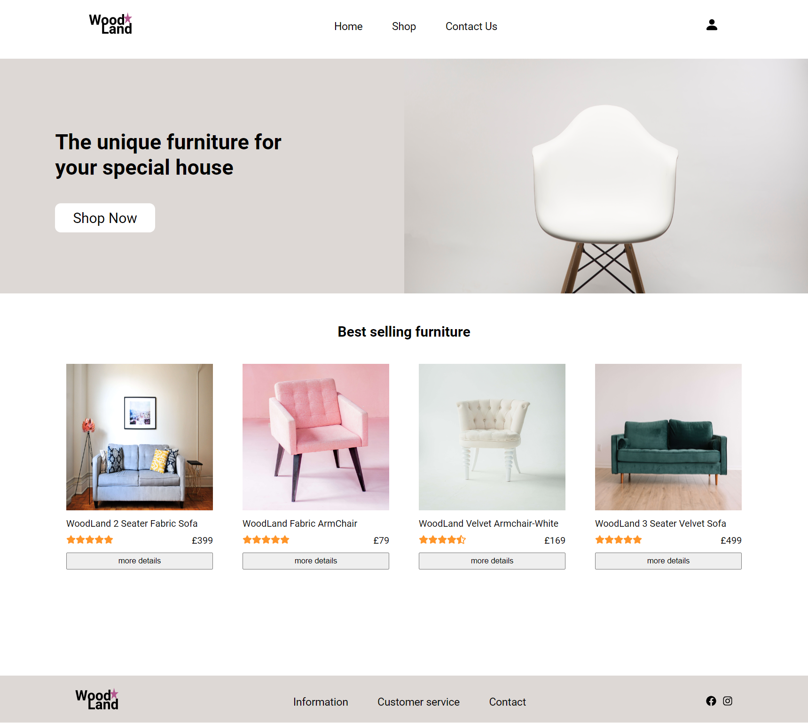
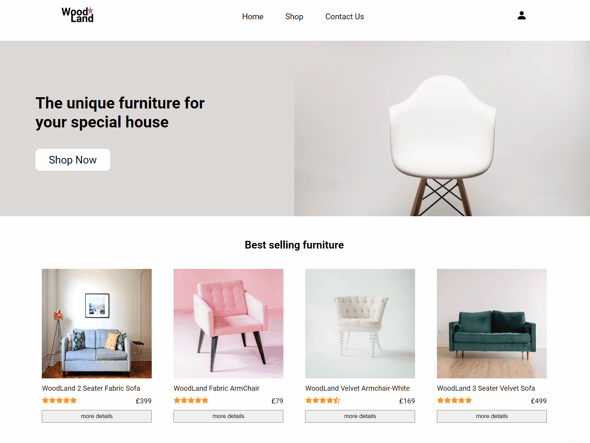
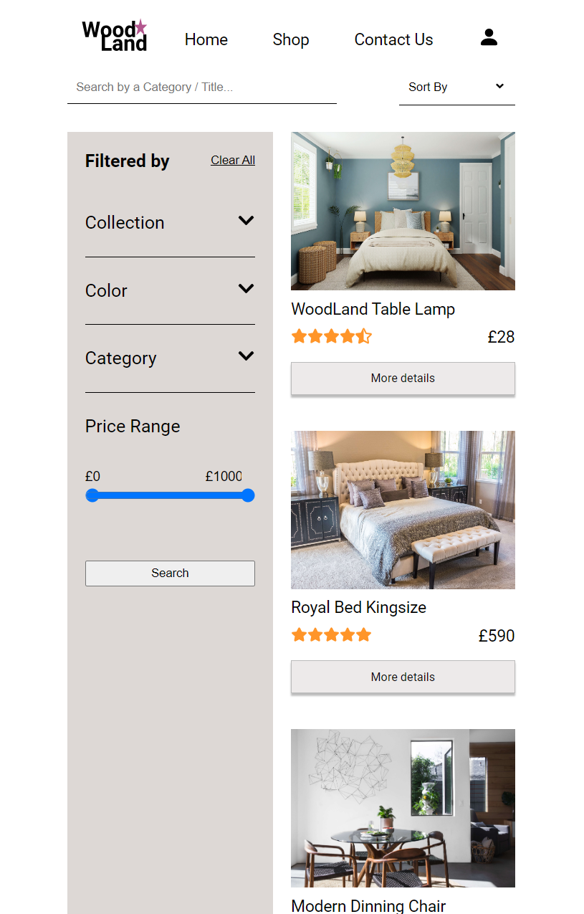

# FurniTrade
> FurniTrade is a fully responsive e-commerce furniture website.

## Description
After learning React during Boolean's bootcamp, we had to complete a solo project using the framework. I had always been curious about how e-commerce websites were built, so I challenged myself to create one in less than a week. I decided to focus on creating an online furniture store due to my passion for interior design. Initially, I used JSON Server for the project, but now I added a backend using MongoDB.

## Main Features & Functions

1. #### Best-Selling Furniture: (Discover and Shop the Latest Trends) ####
A user visits the home page and sees a list of the best-selling furniture items. They click on one of the items to view more details about it.
 

2. #### Sign Up and Save: (Create an Account for Easy Purchasing) ####
The user decides to create an account in order to add items to their basket and make future purchases more easily. They navigate to the login page and enter their email and password to sign up.
 

3. #### Filter and Find: (Browse Products by Type, Color, Collection, and Price) ####
The user wants to browse the available products, so they navigate to the shop page and use the filtering options to narrow down the selection by type, color, collection, and price range.
 

4. #### Search and Sort: (Find the Perfect Product at the Right Price) ####
The user has a specific item in mind that they want to purchase, so they use the search bar to find it. They then sort the search results by price to find the best deal.
 

5. #### Explore and Learn: (View Product Details and Customer Reviews) ####
The user finds an item they like and clicks on it to see more details, including multiple photos, a description, and customer reviews.

6. #### Edit Your Cart: (Remove or Update Items Before Checkout) ####
The user realizes they accidentally added the wrong item to their basket, so they navigate back to the basket and remove the unwanted item from their basket.
 

7. #### Share Your Thoughts: (Write Reviews and Help Others Make Informed Choices) ####
After receiving the item, the user writes a review to share their thoughts and feedback with other customers.
 

7. #### Responsiveness: (Implement responsivness throughout the app) ####
 

## Methods Used
- Navigate UI with **react-router**.
- Implement global state with **useContext** and **useReducer** hooks in **React**.
- Transfer states between routes with **useNavigate**.
- Work with **useLocation** to get the necessary information about the current route.
- Remove the side effect of fetching data from API endpoints by using **useEffect**.
- Create **MongoDB backend** to manage and store data.
- Use **Cloudinary** for storing images, ensuring optimal performance and user experience.
- Utilize two popular third-party libraries: **bcrypt and jsonwebtoken** To ensure secure user authentication and authorization in my app. 

## Tech Stack
- React
- Figma
- MongoDB
- Express.js
- Cloudinary
- Mongoose
- bcrypt & jsonwebtoken

## Installation
- First, run `npm ci` to install the dependencies (need node.js for npm)
- Finally, run `npm run start` to run the app via <a href="http://localhost:3030">localhost<a/> and run `npm run start` for server 

## In Progress
1. Improve search functionality: Enhance the search functionality to include options like autocomplete and suggestions.
2. Implement a payment system: Adding a payment system will allow users to complete their purchases and create a more seamless checkout experience.
